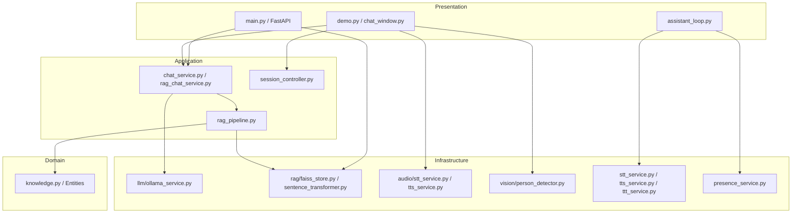
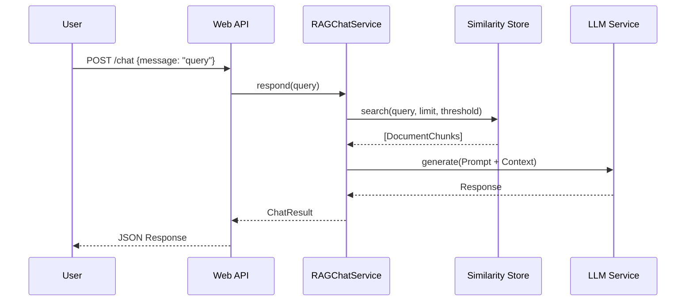

# Campus Helpdesk Robot - Architecture Analysis

## 1. Executive Summary

The Campus Helpdesk Robot is an offline-first, local AI agent designed to provide campus-related information autonomously. It features multi-modal capabilities including vision-based presence detection (OpenCV), speech-to-text (Faster-Whisper), text-to-text generation (Ollama LLM with FAISS RAG), and text-to-speech synthesis (Piper/Meta MMS-TTS).

The repository implements three distinct presentation/execution entry points:
1. **Web API & UI** (`main.py`): A FastAPI backend with a lightweight HTML/JS web frontend.
2. **Desktop GUI** (`demo.py`): A Tkinter-based interactive standalone desktop demonstration.
3. **Autonomous Robot Loop** (`assistant_loop.py`): A headless execution loop for edge devices (like Raspberry Pi) that triggers interactions based on camera presence detection.

The goal of this analysis is to evaluate the architecture for technical debt, bottlenecks, and maintainability to prepare it for production as an offline-first AI product.

## 2. High-Level Architecture

The system follows a clean architecture pattern with layered boundaries:
- **Presentation Layer**: Exposes the system via HTTP (FastAPI), Desktop GUI (Tkinter), or Headless Daemon.
- **Application Layer**: Orchestrates use cases (`ChatService`, `RAGPipeline`, `SessionController`).
- **Domain Layer**: Contains plain business entities (`KnowledgeDocument`, `SearchResult`).
- **Infrastructure Layer**: Implements adapters for external dependencies (Ollama, FAISS, Faster-Whisper, OpenCV, TTS engines).

## 3. Dependency Graphs

### 3.1. Mermaid Dependency Graph


### 3.2. Hierarchical Dependency Tree
```text
Root
├── Presentation Layer
│   ├── main.py (FastAPI App)
│   │   ├── api/router.py
│   │   │   ├── api/routes/chat.py
│   │   │   └── api/routes/system.py
│   ├── demo.py (Desktop MVP)
│   │   └── presentation/chat_window.py
│   └── assistant_loop.py (Raspberry Pi Daemon)
├── Application Layer
│   ├── chat_service.py (Protocol)
│   ├── rag_chat_service.py (RAG + LLM Orchestrator)
│   ├── rag_pipeline.py (Ingestion & Search Orchestrator)
│   ├── session_controller.py (State Machine)
│   └── llm_service.py / knowledge_ports.py (Protocols)
├── Domain Layer
│   └── knowledge.py (Entities: KnowledgeDocument, SearchResult, IngestionResult)
└── Infrastructure Layer
    ├── llm/
    │   └── ollama_service.py (Ollama Client)
    ├── rag/
    │   ├── faiss_store.py (Langchain FAISS Vector Store)
    │   ├── sentence_transformer_embeddings.py (Local Embeddings)
    │   ├── pdf_loader.py (PyMuPDF)
    │   └── text_chunker.py (Recursive Character Splitter)
    ├── vision/
    │   └── person_detector.py (OpenCV Haar/HOG)
    ├── audio/
    │   ├── stt_service.py (Faster-Whisper)
    │   └── tts_service.py (Piper/PyTTSx3)
    └── Legacy Root Modules (Technical Debt)
        ├── presence_service.py
        ├── stt_service.py
        ├── tts_service.py
        └── ttt_service.py
```

## 4. Execution Flows

### 4.1. Web Backend (FastAPI / `main.py`)
1. **Startup**: `create_app()` initializes Settings, logging, `OllamaLLMService`, and `RAGPipeline`. It loads the FAISS index if present.
2. **Request**: User navigates to `/` (loads HTML) or POSTs to `/chat`.
3. **Execution**: `chat` route injects `RAGChatService`. The service calls `rag_pipeline.search()` to fetch context, builds a prompt, and calls `llm_service.generate()`.
4. **Response**: JSON reply sent to client.

### 4.2. Desktop GUI (`demo.py`)
1. **Startup**: Loads configurations, initializes modern infrastructure adapters (RAG pipeline, Ollama, PersonDetector, FasterWhisper, NonBlockingTTS).
2. **Execution**: Launches `ModernChatWindow`.
3. **Vision Loop**: Headless thread runs `detect_in_frame()`. Triggers a greeting if a new face appears.
4. **Chat Loop**: Voice capture triggers `listen_and_transcribe_stream()`. Text passes to `RAGChatService.respond_stream()`. Output streamed to UI and queued to `tts_service.speak()`.

### 4.3. Autonomous Loop (`assistant_loop.py`)
1. **Startup**: Bypasses the layered architecture. Instantiates `PresenceService`, `STTService`, `TTSService`, and `TTTService` from the root directory.
2. **Execution**: `PresenceService` runs a camera thread. When a person is detected, `_on_person_arrived` is triggered.
3. **Interaction**:
   - Robot says "Hi there! Go ahead, I'm listening." (via root `tts_service.py`).
   - Mic opens, recording until silence (`record_until_silence`).
   - Audio is transcribed (via root `stt_service.py`).
   - `TTTService` matches text (regex/canned responses for Indic, or dynamically loads `RAGChatService` for English).
   - Robot speaks response and returns to idle.

## 5. System Components Walkthrough

### 5.1. RAG Pipeline Flow
- **Ingestion** (`ingest.py`): Reads PDFs via `PDFKnowledgeLoader`, splits them via `RecursiveTextChunker`, embeds chunks via `SentenceTransformerEmbeddings`, and stores them in `FAISSSimilarityStore`.
- **Retrieval** (`rag_chat_service.py`): Converts user query to embedding, queries FAISS for top-K chunks within a distance threshold. Extracted text is injected into the LLM system prompt.

### 5.2. LLM Integration
- Primarily uses Ollama with `qwen2.5:1.5b` (optimized for CPU).
- `OllamaLLMService` wraps the `ollama.Client` to generate text. Supports both blocking `generate` and chunked `generate_stream`.

### 5.3. Vision, Speech, and Hardware
- **Vision**: Uses OpenCV Haar cascades (face/eyes) or HOG (body) to trigger engagement. Implements hysteresis (reset threshold) to prevent spamming greetings.
- **STT**: Uses `faster-whisper` (int8 CPU). Employs a custom forced-candidate list (`en, hi, kn`) to improve offline reliability on low-power hardware.
- **TTS**: A two-tier system. Tier 1 checks a local WAV cache (`tts_cache/`). Tier 2 falls back to Piper TTS for English and Meta MMS-TTS for Hindi/Kannada, avoiding blocking the main thread.

## 6. Architectural Weaknesses and Bottlenecks (Technical Debt)

1. **Split Brain / Duplicate Infrastructure**:
   - There are two sets of STT, TTS, and vision services.
   - Set 1 (Modern): `src/campus_helpdesk/infrastructure/audio/` and `src/campus_helpdesk/infrastructure/vision/` (used by `demo.py`).
   - Set 2 (Legacy/Root): Root files `stt_service.py`, `tts_service.py`, `ttt_service.py`, `presence_service.py` (used by `assistant_loop.py`).
   - *Risk*: Features and bug fixes are duplicated or missed. `assistant_loop.py` circumvents the modern layered architecture entirely.

2. **Hidden Instantiations (Service Locators/Lazy Init)**:
   - Root `ttt_service.py` lazily instantiates `RAGChatService` deep inside `_init_rag()`, breaking dependency injection.
   - Similar hidden imports exist in `assistant_loop.py` and `stt_service.py` (mocking `av` modules).

3. **Inconsistent Asynchrony / Concurrency**:
   - The Desktop GUI manually manages complex PyAudio streams, tkinter `after()` loops, and threading events.
   - The `assistant_loop.py` uses `sounddevice.rec` and simple threading arrays.
   - Web API is entirely synchronous (`def chat` instead of `async def chat`), meaning one slow inference request blocks a web worker.

4. **Hardcoded Logic & Localization Hacks**:
   - `ttt_service.py` contains hardcoded Indic language FAQ responses (regex matching) bypassing RAG/LLM entirely for non-English languages.
   - `tts_service.py` hardcodes caching logic and hashing algorithms.

5. **Fragile State Management**:
   - GUI state (`RobotStatus`), `SessionController`, `PresenceService`, and `PersonDetector` all track engagement separately. Maintaining sync across vision, audio, and UI is bug-prone.

## 7. Opportunities for Simplification & Next Steps

1. **Consolidate Execution Paths**:
   - Refactor `assistant_loop.py` to use the modern dependency-injected layers (`src/.../infrastructure`). Delete the legacy root modules (`presence_service.py`, `ttt_service.py`, etc.).
2. **Unified Core Engine**:
   - Create a central `RobotEngine` class that manages Vision, STT, LLM, and TTS lifecycles universally for both the GUI and Headless daemon.
3. **Async Web API**:
   - Migrate `main.py` endpoints to `async def` and wrap Ollama calls in thread pools to allow concurrent web connections.
4. **Normalize Localization**:
   - Move the hardcoded regex logic from `ttt_service.py` into a proper Intent Routing layer, or prompt the LLM to handle translation internally using its multilingual weights (`qwen2.5` natively supports Indic languages).


## 8. Architectural Strengths

1. **True Offline Capability**: The integration of Ollama, local Sentence Transformers, FAISS, and Faster-Whisper CPU optimizations achieves genuine offline operation.
2. **Layered API Application**: The core `src/campus_helpdesk` module effectively uses dependency injection (via Protocols) and a clean separation of concerns. `main.py` is thin and testable.
3. **Resilient Vision Fallbacks**: The vision module intelligently falls back from strict Haar face detection to HOG full-body detection, improving robustness under varying lighting conditions.
4. **Non-Blocking TTS**: The TTS module (`NonBlockingTTSService`) properly utilizes background queues and threads to prevent audio synthesis from blocking the GUI main loop.

## 9. Data Flow Diagrams

### User Query Data Flow (API & RAG)


## 10. Prioritized List of Observations

1. **High Priority (Tech Debt Cleanup)**: Delete the legacy root modules (`ttt_service.py`, `presence_service.py`, `stt_service.py`, `tts_service.py`) and refactor `assistant_loop.py` to use the modern `src/campus_helpdesk/infrastructure` packages. This resolves the dangerous "split brain" architecture.
2. **Medium Priority (Asynchronous I/O)**: Update the FastAPI routing in `main.py` and the `LLMService` protocol to support `async/await`. This will prevent the web server from hanging during slow local CPU inference tasks.
3. **Medium Priority (Localization Strategy)**: Remove hard-coded Indic text blocks from Python code. Configure prompt templates or external configuration files to handle localized responses dynamically via the multilingual LLM.
4. **Low Priority (State Management)**: Create a central `RobotState` store (potentially using Redux-like patterns) to synchronize the GUI view, camera triggers, and audio state, preventing race conditions where the robot might try to speak and listen simultaneously.
