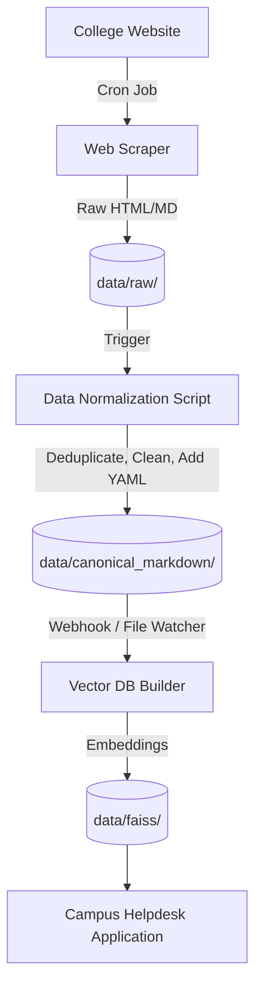

# Knowledge Base Architecture Review

This document provides an engineering recommendation for restructuring the RAG pipeline to properly integrate the scraped data, addressing the gap identified in the previous analysis.

## 1. Primary Knowledge Source Format

**Recommendation: Markdown (`.md`) should become the primary canonical knowledge format.**

The production RAG pipeline should *not* ingest PDFs directly at runtime, nor should it ingest raw HTML. Scraped web content and OCR'd PDFs should all be normalized into a well-structured, canonical Markdown format *before* reaching the application layer.

### 2. Format Comparison

| Format | Advantages | Disadvantages |
|--------|------------|---------------|
| **Markdown (Recommended)** | Extremely high density of semantic information (headers, lists, tables). Minimal token overhead for the LLM. Easy to diff, version control (git), and chunk cleanly. | Requires an upfront conversion step from source materials (PDFs/Web). |
| **PDF** | True to original formatting. Easiest for administrators to just "drop in a folder". | Awful for RAG. OCR errors, loss of table structures, floating headers/footers pollute context windows. Impossible to track changes via `git diff`. |
| **HTML** | Preserves all semantic web structure. | Horrendous token overhead. CSS classes, divs, and scripts overwhelm the LLM context window with useless noise. |
| **Plain Text** | Smallest token footprint. Fastest to parse. | Loses all semantic meaning (no distinction between a Title and a paragraph). Tables turn into unreadable walls of text. |

## 3. Review of the Scraped Markdown Quality

The current markdown generated by `bvbcet_scraper` is **not production-ready**:
- **Duplicate Pages:** There are over 50 variations of `programs_<hash>.md` (e.g., `programs_19db17.md`, `programs_4dfe19.md`) that contain the exact same list of degrees. This will poison the vector store and cause FAISS to retrieve the same text chunk 4 times instead of diverse context.
- **Tiny Files:** Files like `home_baca25.md` (52 bytes) contain nothing but a source URL.
- **Missing Metadata:** The files lack YAML Frontmatter. The LLM needs metadata (Author, Date, Category, Exact URL) injected into the chunk to properly cite sources.
- **Raw PDF Dumps:** Files like `bachelor-computer-science-engineering-curriculum-2022-2026.md` (300KB+) are just raw text dumps of PDFs converted to MD, complete with formatting noise like `FMCD2009 / 2.0`.

**Verdict:** The `archive/` directory must be treated as a *raw data lake*, not a canonical knowledge base.

## 4. Canonical Directory Structure

A new directory structure must be established separating RAW ingestion from CANONICAL data.

```text
data/
├── raw/                      # Landing zone for the scraper and uploaded PDFs
│   ├── scraper_output/
│   └── manual_pdfs/
├── canonical_markdown/       # Cleaned, deduplicated, and reviewed Markdown (Version Controlled)
│   ├── admissions/
│   ├── academics/
│   └── campus_life/
└── faiss/                    # Ephemeral build artifact (Ignored in git)
```

## 5. Production-Grade Knowledge Base Architecture

### Workflows
1. **Ingestion Workflow:** The web scraper and PDF parsers output to `data/raw/`.
2. **Update (Normalization) Workflow:** A separate Python script (`data_cleaner.py`) runs over the raw data. It:
   - Removes boilerplate (headers/footers).
   - Generates YAML Frontmatter (URL, Title, Hash).
   - Deduplicates identical pages using content hashing.
   - Outputs pristine `.md` files to `data/canonical_markdown/`.
3. **Indexing Workflow:** The main application's RAG pipeline (`ingest_service.py`) reads *only* from `data/canonical_markdown/`, chunks by markdown headers (`#`, `##`), and builds the FAISS store.
4. **Versioning Strategy:** The `data/canonical_markdown/` directory should be tracked in Git. This provides an exact audit trail of what the Robot "knows" at any given commit.

## 6. Automation: Scraper to FAISS Data Flow



To automatically update the knowledge base without manual copying:
1. A cron job runs the scraper daily.
2. The scraper triggers the normalization script.
3. If the normalization script detects changes in `data/canonical_markdown/`, it triggers `ingest.py` to rebuild the FAISS index.
4. The Helpdesk Application hot-reloads the FAISS index when the `index-manifest.json` timestamp changes.

## 7. Components That Must Change

1. **`src/campus_helpdesk/infrastructure/rag/pdf_loader.py`**: Must be renamed/refactored to `MarkdownKnowledgeLoader.py` and updated to parse `.md` files and extract YAML frontmatter.
2. **`src/campus_helpdesk/infrastructure/rag/text_chunker.py`**: Must change from `RecursiveCharacterTextSplitter` to `MarkdownHeaderTextSplitter` to chunk semantically by headers rather than arbitrary character counts.
3. **`src/campus_helpdesk/ingest.py`**: Must be updated to read exclusively from `data/canonical_markdown/`.
4. **`archive/bvbcet_scraper/`**: Must be refactored to output to `data/raw/` instead of `archive/`.

## 8. Migration Plan

### Implementation Order
1. **Phase 1: Create the Normalization Script**
   - Write a script to clean `archive/` data and move it to `data/canonical_markdown/`. Deduplicate the `programs_*.md` files.
2. **Phase 2: Update Application Loaders**
   - Refactor `PDFKnowledgeLoader` to read `.md` files.
   - *Backward Compatibility:* Keep PDF loading logic temporarily alongside MD loading.
3. **Phase 3: Update Chunking Strategy**
   - Implement Markdown header splitting.
4. **Phase 4: Rebuild FAISS Index**
   - Run the updated ingestion script to build a new FAISS index from the canonical markdown.
5. **Phase 5: Cleanup**
   - Delete `archive/`, remove PDF loading code from the live pipeline.

### Risks
- **Vector Drift:** Changing the chunking strategy from Character splitting to Markdown splitting will change the FAISS embeddings entirely. All previous distance threshold tuning (`rag_distance_threshold=2.0`) will need to be re-calibrated.
- **LLM Prompting:** The LLM system prompt assumes it receives raw text snippets. It will now receive structured markdown. The prompt may need adjustment to understand YAML frontmatter correctly.
