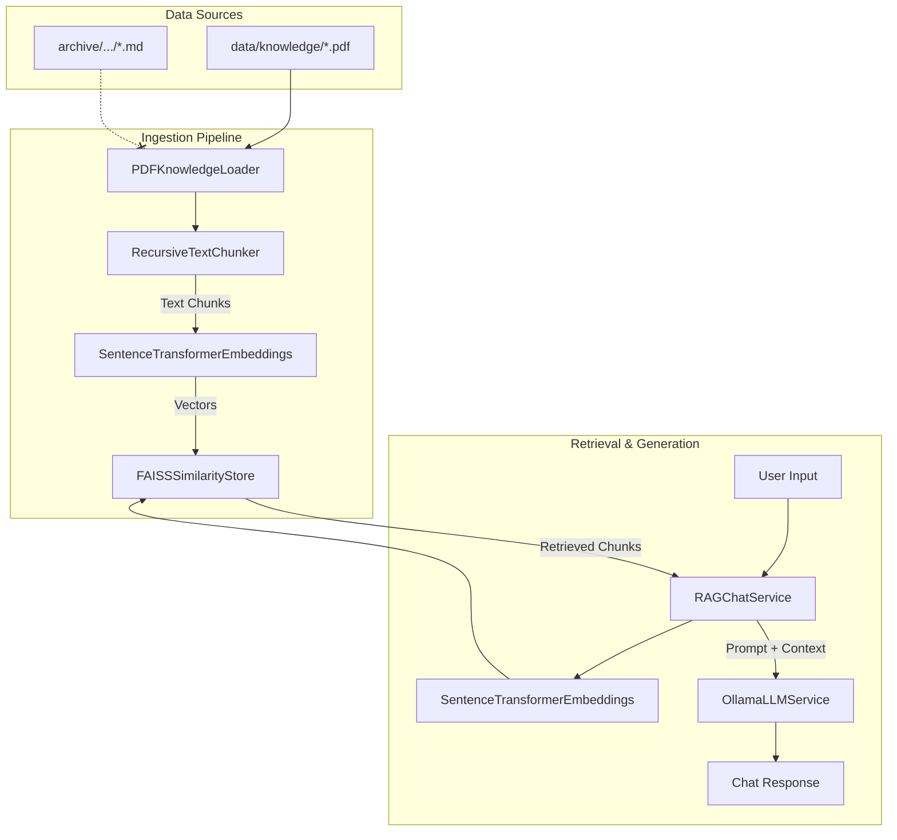

# Knowledge Base and RAG Pipeline Analysis Report

This document answers the specific questions regarding the usage of scraped Markdown files within the Campus Helpdesk Robot's RAG pipeline.

### 1. Where are the scraped .md files located?
The scraped Markdown files are located inside the `archive/` directory, specifically under:
`./archive/bvbcet_scraper/knowledge_base/markdown/`

### 2. Which ingestion script(s) process them?
There are two ingestion scripts in the repository:
1. `src/campus_helpdesk/ingest.py`: A standalone script that *does* include logic to process `.md`, `.txt`, and `.pdf` files.
2. `src/campus_helpdesk/infrastructure/rag/ingest_service.py`: An infrastructure service class that *only* looks for `*.pdf` files.

However, neither script is currently configured to point to the `archive/` directory. The standalone `ingest.py` specifically targets `data/knowledge` and `pdfs`.

### 3. Does the ingestion pipeline support Markdown, or only PDFs?
- The **standalone script** (`src/campus_helpdesk/ingest.py`) supports Markdown via `langchain_community.document_loaders.TextLoader`.
- The **actual Application Layer pipeline** used by the web API and desktop GUI (`src/campus_helpdesk/application/rag_pipeline.py` and `PDFKnowledgeLoader`) **only supports PDFs**. It explicitly checks `if source_path.suffix.casefold() != ".pdf": raise ValueError(...)`.

### 4. Which files are actually indexed into the vector database?
Currently, **no files** appear to be indexed into the production FAISS database on this environment. The `data/faiss/` and `data/knowledge/` directories do not exist. If the pipeline were to run, the Application Layer restricts ingestion entirely to PDFs.

### 5. Where is the FAISS/vector store built?
According to the codebase configurations (`ingest.py` and `settings.py`), the FAISS store is intended to be built at:
`data/faiss/`
An alternative backup path `college_faiss_index/` is also referenced in the standalone script.

### 6. Is the current vector database built from the latest scraped data?
**No.** There is a complete disconnect between the data in `archive/` and the application's runtime directories (`data/knowledge/` and `data/faiss/`). The application is currently missing its vector database, and the scraped Markdown files are orphaned.

### 7. Which application components query this knowledge base?
The `RAGChatService` queries the knowledge base. It receives user prompts, embeds them via `SentenceTransformerEmbeddings`, and performs a semantic search against the `FAISSSimilarityStore`. It injects the resulting text chunks into the prompt for the `OllamaLLMService`.

### 8. Complete Data Flow

*(Notice the `OrphanedMD` files are disconnected from the Loader).*

### 9. Identify any scraped files that are never used.
**All files** located in `./archive/bvbcet_scraper/knowledge_base/markdown/` are completely unused by the application. This includes dozens of admission program files (`programs_*.md`), placement brochures, and faculty news updates.

### 10. Gaps between scraped data and the live RAG pipeline
1. **Format Mismatch**: The application layer (`PDFKnowledgeLoader`) strictly rejects `.md` files.
2. **Directory Mismatch**: The scraper outputs to `archive/` but the ingestion logic looks in `data/knowledge/`.
3. **Data Freshness**: Because the `.md` files are ignored, any real-time updates gathered by the scraper are invisible to the Helpdesk Robot. It is solely reliant on manually placed PDF files.
