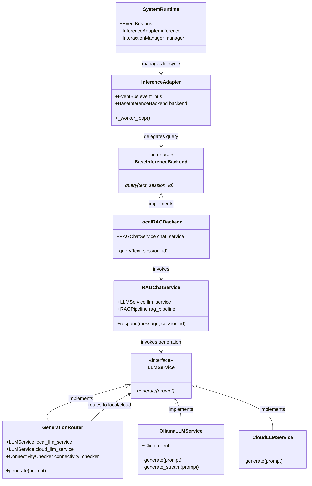

# Architecture Investigation Report: Online/Offline Hybrid Generation Backend

This report evaluates whether the current generation architecture of the Campus Helpdesk can support an online/offline hybrid backend without modifying the existing retrieval (RAG) pipeline, ensuring retrieval remains the single local source of truth.

---

## 1. Current Execution Flow (`TRANSCRIPT_FINAL` to `ANSWER_READY`)

When a user finishes speaking and the speech-to-text pipeline completes, the system processes the request end-to-end. Below is the sequence of events and method calls:

```mermaid
sequenceDiagram
    participant STT as STT Service
    participant Bus as Event Bus
    participant IM as Interaction Manager
    participant IA as Inference Adapter
    participant LB as Local RAG Backend
    participant CS as RAG Chat Service
    participant GR as Generation Router
    participant LLM as LLM Services (Local/Cloud)
    participant TTS as TTS Service

    STT->>Bus: Publish TRANSCRIPT_FINAL
    activate Bus
    Bus-->>IM: Notify TRANSCRIPT_FINAL
    activate IM
    IM->>IM: Transition FSM to PROCESSING (via _handle_transcript_final)
    IM->>Bus: Publish QUERY_STARTED (diagnostic control event)
    deactivate IM
    Bus-->>IA: Notify TRANSCRIPT_FINAL
    deactivate Bus
    activate IA
    IA->>IA: Enqueue event in _queue (via _enqueue_request)
    Note over IA: IA Worker Thread pulls event
    IA->>Bus: Publish QUERY_STARTED (query payload)
    IA->>LB: Call query(query_text, session_id)
    activate LB
    LB->>CS: Call respond(message, session_id)
    activate CS
    Note over CS: 1. Detect language (LanguageDetector)<br/>2. Rewrite query (QueryRewriter)<br/>3. Execute Hybrid RAG search (RAGPipeline)<br/>4. Evaluate confidence (ConfidenceEngine)<br/>5. Build context & prompt (PromptContextBuilder)
    CS->>GR: Call generate(prompt)
    activate GR
    Note over GR: Route based on online status<br/>and settings.enable_cloud_llm_router
    alt Online & Router Enabled
        GR->>LLM: Call CloudLLMService.generate(prompt)
        activate LLM
        LLM-->>GR: Return cloud response text
        deactivate LLM
    else Offline or Router Disabled
        GR->>LLM: Call OllamaLLMService.generate(prompt)
        activate LLM
        LLM-->>GR: Return local response text
        deactivate LLM
    end
    GR-->>CS: Return response text
    deactivate GR
    Note over CS: 6. Validate citations (CitationValidator)<br/>7. Append to session memory (SessionManager)
    CS-->>LB: Return ChatResult
    deactivate CS
    LB-->>IA: Return (reply, citations, score, level)
    deactivate LB
    IA->>Bus: Publish ANSWER_READY
    deactivate IA
    activate Bus
    Bus-->>IM: Notify ANSWER_READY
    activate IM
    IM->>IM: Transition FSM to SPEAKING (via _handle_answer_ready)
    deactivate IM
    Bus-->>TTS: Notify ANSWER_READY (trigger playback)
    deactivate Bus
```



### Detailed Trace Steps:
1. **Event Trigger:** `STTService` publishes `TRANSCRIPT_FINAL` to the central `EventBus`.
2. **State Transition:** `InteractionManager` handles `TRANSCRIPT_FINAL`, updates its internal context (`last_transcript_id`), transitions the `RobotStateMachine` from `LISTENING`/`READY` to `PROCESSING`, and dispatches a diagnostic `QUERY_STARTED` event.
3. **Queue Ingestion:** `InferenceAdapter` (subscribed to `TRANSCRIPT_FINAL`) enqueues the event into a FIFO queue (`self._queue`) to enforce sequential processing.
4. **Worker Execution:** The `InferenceAdapter-worker` thread pulls the event, publishes a data-carrying `QUERY_STARTED` event to the bus, and runs the query against its configured `BaseInferenceBackend` inside a thread execution wrapper (with a default 10.0s timeout).
5. **Backend Invocation:** The production backend, `LocalRAGBackend` (declared in [inference_adapter.py:L84](file:///d:/helpdesk/anti/src/campus_helpdesk/services/inference_adapter.py#L84)), invokes `chat_service.respond(message, session_id)`.
6. **RAG Pipeline & Context Construction:** `RAGChatService.respond` (declared in [rag_chat_service.py:L60](file:///d:/helpdesk/anti/src/campus_helpdesk/application/rag_chat_service.py#L60)) executes:
   - Language detection.
   - Conversational greeting intercept (short-circuiting early).
   - Input sanitization via `sanitize_user_input`.
   - Query rewriting via `QueryRewriter.rewrite` (using conversation memory).
   - Knowledge base retrieval via `RAGPipeline.search`.
   - Confidence scoring via `ConfidenceEngine.evaluate`.
   - Context compiling via `PromptContextBuilder.build_context`.
   - Answerability check via `AnswerabilityEngine.evaluate_answerability`.
   - Prompt formatting (combining system instructions, memory, context, and query).
7. **Generation Boundary:** `RAGChatService` calls `self._llm_service.generate(prompt)`. The injected dependency is a `GenerationRouter` (declared in [generation_router.py:L14](file:///d:/helpdesk/anti/src/campus_helpdesk/infrastructure/llm/generation_router.py#L14)).
8. **Routing Decision:** `GenerationRouter` evaluates `ConnectivityChecker.is_online()`. If `enable_cloud_llm_router` is `True` and the network is online, it forwards the prompt to `CloudLLMService.generate(prompt)`; otherwise, it falls back to `OllamaLLMService.generate(prompt)`.
9. **Citation Post-Processing:** The generated response is returned to `RAGChatService.respond`, which cleans up any invalid references via `CitationValidator.validate_citations`, saves the interaction to the `SessionManager`, and returns a `ChatResult` to `LocalRAGBackend`.
10. **Event Dispatch:** `InferenceAdapter` receives the result and publishes `ANSWER_READY` containing the answer text and confidence metrics.
11. **TTS Output:** `InteractionManager` processes `ANSWER_READY`, transitions the robot state to `SPEAKING`, and `TTSService` begins voice synthesis.

---

## 2. Dependency Diagram

The architectural diagram below shows the relationships between components. The design maintains clean boundaries by decoupling the event-handling wrapper (`InferenceAdapter`) from the actual generation router (`GenerationRouter`):



---

## 3. Generation Flow & Boundaries

The generation pipeline has a strict separation between **local state processing** and **text generation**:

1. **Local Boundary (Inputs & Preparation):**
   - The input is the raw query string and the conversational session ID.
   - All state, memory lookup, document retrieval (FAISS/BM25), reranking, and scoring happen **entirely locally**.
   - The result of this stage is a single, fully structured, plain-text prompt.
2. **Generation Boundary (Inference):**
   - The boundary is the `LLMService.generate(prompt) -> str` call.
   - The prompt contains all factual details needed to answer the question.
   - The generation backend (local or cloud) acts as a stateless text synthesizer. It has no external search capability and does not fetch extra knowledge.
3. **Local Boundary (Post-Processing & Output):**
   - The generated response is returned locally.
   - The system cleans up citations, logs conversation statistics, and stores history.
   - The result is dispatched via `ANSWER_READY`.

---

## 4. Current Prompt Construction

The prompt sent to the LLM is assembled in `RAGChatService.respond` (lines 194-209):

```
[DEFAULT_SYSTEM_PROMPT]

History:
[Formatted Conversation History, e.g.]
user: Where is the vice chancellor's office?
assistant: The Vice Chancellor's office is located in the main administrative block on the first floor.

Context:
[Formatted RAG Document Context chunks joined together, e.g.]
Document: campus_map.md
Location: Vidyanagar, Hubballi. The admin block is near the main entrance.

[Optional Non-English Language Translation Instructions]

User Question: [Current User Message]
```

- **`DEFAULT_SYSTEM_PROMPT`** ([rag_chat_service.py:L21](file:///d:/helpdesk/anti/src/campus_helpdesk/application/rag_chat_service.py#L21)): Instructs the model to act as the campus assistant, reply in 1 to 2 sentences, base the answer strictly on the provided context, and say it doesn't have information only if the context is empty.
- **`History`**: Formatted as a raw string of previous turns.
- **`Context`**: Built by `PromptContextBuilder` using distance-filtered chunks.
- **`Language Instruction`**: Placed conditionally if the query language is detected as Hindi (`hi`) or Kannada (`kn`).

---

## 5. Candidate Insertion Point

There are two potential places in the codebase to insert a cloud routing mechanism:

### Option A: `BaseInferenceBackend` Layer (inside `InferenceAdapter`)
We could create a `CloudRAGBackend(BaseInferenceBackend)` that routes requests to a cloud service.
- **Pros:** Completely bypasses the local Python RAG processes, saving local CPU and memory.
- **Cons:** Bypassing local retrieval violates the constraint that "retrieval must remain the only knowledge source" and "Cloud generation must never perform retrieval". It would require duplicating retrieval and prompt engineering logic in the cloud, breaking the architecture's modularity.

### Option B: `LLMService` Layer (inside `RAGChatService` via `GenerationRouter`)
Routing is handled at the `LLMService` protocol level.
- **Pros:** Preserves the local RAG pipeline (retrieval, confidence grading, prompt compiling) as the single source of truth. The cloud service only receives the final prompt and synthesizes the response, guaranteeing it never performs retrieval.
- **Cons:** Local hardware still performs vector and keyword searches (though this is extremely lightweight compared to running a local LLM).
- **Current Status:** **This option is already implemented.** The `GenerationRouter` class and `CloudLLMService` are configured and wired in `main.py` via `create_llm_service(settings)`.

---

## 6. Migration Strategy to Enable Hybrid Backend in Production

Although the `GenerationRouter` is wired up, several gaps and bugs must be resolved before deploying this hybrid architecture to production:

1. **Fix Streaming in `GenerationRouter`:**
   - Currently, `GenerationRouter` does not implement `generate_stream(self, prompt: str)`.
   - If the system calls `RAGChatService.respond_stream(...)`, it will raise an `AttributeError` and crash the UI fallback loop.
   - **Fix:** Add a matching `generate_stream` method in `GenerationRouter` that forwards requests to the active backend.
2. **Implement Streaming in `CloudLLMService`:**
   - `CloudLLMService` only has a blocking `generate` method.
   - **Fix:** Implement `generate_stream` using Server-Sent Events (SSE) parsing to yield tokens from the Gemini/OpenRouter API.
3. **Fix the Local Stream Retry Wrapper:**
   - `OllamaLLMService.generate_stream` has a bug where the retry decorator does not execute the generator body, making streaming errors unrecoverable.
   - **Fix:** Refactor `generate_stream` to properly run the generator and handle connection exceptions.
4. **Configure Settings and Environment:**
   - Configure the environment variables (`CLOUD_LLM_API_KEY`, `ENABLE_CLOUD_LLM_ROUTER=True`, `CLOUD_LLM_PROVIDER=gemini`, and `CLOUD_LLM_MODEL=gemini-1.5-flash`) in `config.yaml` or `.env`.

---

## 7. Affected Files

Below are the files requiring modifications to safely enable online/offline hybrid generation:

| File Path | Reason | Risk | Complexity |
| :--- | :--- | :--- | :--- |
| [llm_service.py](file:///d:/helpdesk/anti/src/campus_helpdesk/application/llm_service.py) | Formally add `generate_stream` to `LLMService(Protocol)` to ensure type safety. | Low | Low |
| [generation_router.py](file:///d:/helpdesk/anti/src/campus_helpdesk/infrastructure/llm/generation_router.py) | Add `generate_stream` logic to route stream chunks dynamically. | Medium | Medium |
| [cloud_llm_service.py](file:///d:/helpdesk/anti/src/campus_helpdesk/infrastructure/llm/cloud_llm_service.py) | Implement SSE streaming for Gemini/OpenRouter REST API. | Medium | Medium-High |
| [ollama_service.py](file:///d:/helpdesk/anti/src/campus_helpdesk/infrastructure/llm/ollama_service.py) | Fix the broken `generate_stream` retry decorator. | Low | Low |
| [settings.py](file:///d:/helpdesk/anti/src/campus_helpdesk/config/settings.py) | Ensure default parameters and environment mapping for cloud backends are robust. | Low | Low |

---

## 8. Architectural Risks

1. **Model Output Drift:**
   - Cloud Gemini (1.5 Flash) is significantly larger and more capable than local Qwen (1.5B/3B). It may generate longer, more detailed, or differently formatted responses, occasionally ignoring constraints like the "1 to 2 sentences" rule.
   - If the network goes offline, the sudden switch to local Qwen will cause noticeable changes in response style and grammar, leading to an inconsistent user experience.
2. **Failover Latency Spikes:**
   - The `ConnectivityChecker` pings `1.1.1.1` and caches the result for 15 seconds. If the internet connection drops mid-request during a 15-second window, the system will attempt to call the cloud endpoint, hang until the cloud timeout is reached (default 25.0s), and only then fall back to local generation. This results in a 25+ second lag for the user.
3. **Data Security & Privacy:**
   - While the local RAG pipeline is offline-first, routing to a Cloud LLM sends the user's question and the retrieved context chunks (which may contain internal campus maps, phone directories, or staff listings) to third-party endpoints (Google Gemini or OpenRouter), which may violate privacy regulations.
4. **Billing & Rate Limits:**
   - Production systems will rely on API keys. If keys expire, run out of credits, or hit rate limits, the system will silently fall back to the local model. While this keeps the system online, it makes performance monitoring and debugging more difficult.
