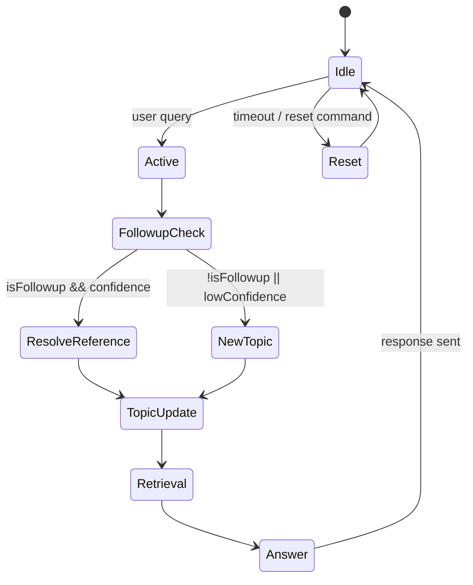

# Conversation Manager Implementation Plan

## Architecture Overview

```mermaid
flowchart LR
    subgraph UI[User Interface]
        U[User]
    end
    subgraph CM[Conversation Manager]
        CMgr[ConversationManager]
        Mem[Memory (Short‑term)]
        CT[ContextTracker]
        RR[ReferenceResolver]
        FD[FollowupDetector]
        TS[TopicTracker]
        QUP[QueryUnderstandingPipeline]
    end
    subgraph RAG[Retrieval & Generation]
        RAGPipe[RAGPipeline]
        LLM[Local LLM]
    end
    U -->|query| CMgr
    CMgr --> Mem
    CMgr --> CT
    CMgr --> RR
    CMgr --> FD
    CMgr --> TS
    CMgr --> QUP
    QUP --> RAGPipe
    RAGPipe --> LLM
    LLM -->|answer| CMgr
    CMgr -->|final answer| U
```

## Component Responsibilities

| Component | Responsibility |
|-----------|-----------------|
| **ConversationManager** | Orchestrates all sub‑components, receives raw user query, returns response. |
| **Memory** | Stores last *N* turns (configurable, default 10). Each turn records: user query, system answer, retrieved document IDs, extracted entities (department, faculty, building, etc.). |
| **ContextTracker** | Maintains the current active topic and extracts entities from recent turns. |
| **ReferenceResolver** | Resolves pronouns and deictic phrases ("there", "it", "that department") using the Memory store and entity map. |
| **FollowupDetector** | Detects whether the incoming query is a follow‑up vs. a new independent question. Returns a boolean and a confidence score. |
| **TopicTracker** | Determines the active conversation topic (Admission, Departments, etc.) via keyword/regex matching and optional lightweight classifier. |
| **QueryUnderstandingPipeline** | Existing modules (normalizer, abbreviation handler, spell corrector, query expander, intent detector) are reused; they receive the *context‑augmented* query. |
| **RAGPipeline** | Unchanged – receives the final enriched query and returns ranked chunks. |
| **LLM** | Generates the final answer using retrieved chunks and the conversation context. |

## Data Flow (per turn)
1. **User → ConversationManager**: raw query.
2. **FollowupDetector** evaluates if the query is a follow‑up using recent Memory entries.
3. **ReferenceResolver** rewrites the query by replacing pronouns/deictic expressions with concrete entities extracted from Memory.
4. **TopicTracker** updates the active topic (may reset on a large topic shift).
5. **ContextTracker** merges relevant previous context (previous query/answer, retrieved docs) with the current query – produces *augmented query*.
6. **QueryUnderstandingPipeline** normalizes, expands abbreviations, corrects spelling, expands synonyms, detects intent.
7. **RAGPipeline** executes hybrid retrieval and cross‑encoder reranking.
8. **LLM** generates response using retrieved chunks and the full conversation history.
9. **Memory** appends a new turn (raw query, resolved query, answer, doc IDs, extracted entities, topic).
10. Return answer to user.

## Memory Lifecycle
- **Initialization**: on session start, `Memory` is empty; config loads `max_turns` (default 10) and `idle_timeout` (seconds).
- **Retention**: after each turn, if length > `max_turns`, oldest turn is dropped.
- **Expiration**: a background timer clears the entire Memory after `idle_timeout` of inactivity or when an explicit `reset` command is received.
- **Persistence** *(optional)*: lightweight JSON dump can be stored to `/tmp` for short‑lived sessions; not required for Pi deployment.

## Context Resolution Strategy
1. **Entity Extraction** – simple rule‑based regex + configurable keyword lists (departments, faculties, buildings). Stored in each turn.
2. **Pronoun Mapping** – when `ReferenceResolver` sees a pronoun, it looks backwards through Memory for the most recent turn containing a matching entity type.
3. **Confidence Threshold** – if confidence < `reference_confidence` (configurable, default 0.7) the query is passed unchanged and a fallback reminder may be logged.
4. **Fallback** – if resolution fails, the system includes the previous turn verbatim in the retrieval query to give the model more context.

## Conversation State Machine

- **Idle** – waiting for user input.
- **Active** – query received.
- **FollowupCheck** – determines follow‑up status.
- **ResolveReference / NewTopic** – builds context.
- **TopicUpdate** – may change the active topic.
- **Retrieval** – runs the enriched query through the existing RAG pipeline.
- **Answer** – combines LLM output with memory update.
- **Reset** – clears memory.

## Raspberry Pi Resource Considerations
- **Memory footprint**: limit `max_turns` to 6–8 for very constrained devices; each turn stores only IDs and short strings.
- **CPU**: all NLP components are rule‑based (regex, simple lookup) – no heavy embeddings.
- **Disk I/O**: config files are YAML; loading occurs once at start.
- **Latency**: aim for < 200 ms per turn (excluding LLM inference). Use lazy loading and cache resolved entities.
- **Threading**: run the background idle‑timer using the standard `threading.Timer` – low overhead.

## Integration Points
- **`src/campus_helpdesk/application/rag_pipeline.py`** – unchanged; `ConversationManager` will call its `search` method with the enriched query.
- **Existing Query Understanding modules** – located under `src/campus_helpdesk/conversation/`; they will be imported by `ConversationManager`.
- **Configuration** – new file `config/conversation.yaml` loaded by `ConversationManager` at startup.
- **Logging** – each component obtains a logger via `logging.getLogger(__name__)`; logs include turn index, resolved query, topic, and confidence scores.

## File Structure
```
src/campus_helpdesk/
│
├─ conversation/
│   ├─ __init__.py
│   ├─ conversation_manager.py      # orchestrator
│   ├─ memory.py                    # short‑term memory store
│   ├─ context_tracker.py           # merges prior context
│   ├─ reference_resolver.py        # pronoun/deictic resolution
│   ├─ followup_detector.py         # follow‑up classification
│   ├─ topic_tracker.py             # active topic identification
│   └─ conversation_state.py        # state‑machine implementation
│
├─ config/
│   └─ conversation.yaml            # configurable params
│
└─ evaluation/
    └─ conversation_benchmark.py   # benchmark script (future)
```

## Open Design Questions
- **Entity Extraction Granularity** – Should we rely solely on keyword lists or integrate a lightweight NER model (e.g., spaCy small) for better recall?
- **Follow‑up Detection Method** – Rule‑based scoring vs. a tiny transformer classifier; trade‑off between accuracy and Pi resources.
- **Topic Confidence Threshold** – What default confidence should trigger an automatic topic reset?
- **Memory Persistence** – Is a temporary JSON dump useful for session continuity across restarts, or should memory always be volatile?
- **Evaluation Metrics** – Apart from recall/latency, should we measure *contextual coherence* (e.g., BLEU against multi‑turn gold dialogs)?
- **Scalability of Reference Resolution** – How many recent turns should be scanned for pronoun antecedents to balance accuracy and speed?

---
**Next Steps**
1. Confirm the architecture and resolve the open questions above.
2. Once approved, proceed with creating the package files and implementing each component.

*Please review and approve or provide feedback.*
