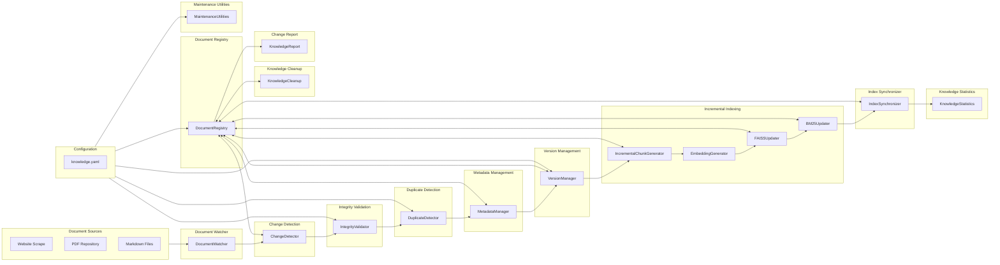
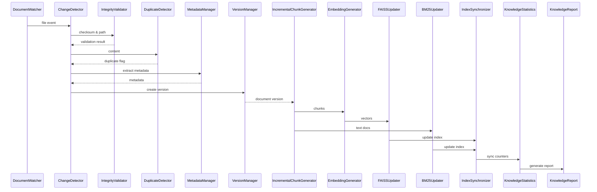
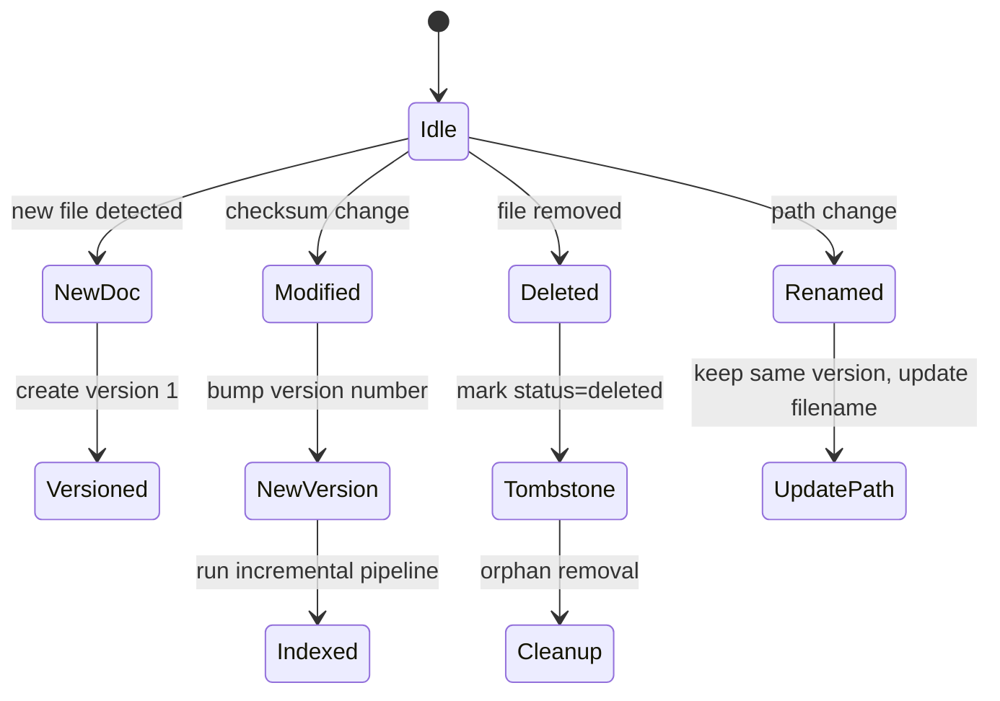

# Knowledge Base Management System Implementation Plan

## 1. Architecture Overview



## 2. Component Descriptions

| Component | Responsibility |
|-----------|-----------------|
| **DocumentWatcher** | Monitors configured directories (`watch_directories`) for file system events (create, modify, delete, rename). Uses OS‑level notifications (`watchdog` on Linux) or periodic polling for Pi compatibility. |
| **ChangeDetector** | Computes SHA‑256 checksum of each discovered file, compares with the stored checksum in the **DocumentRegistry** to classify the change (new, modified, deleted, renamed). |
| **IntegrityValidator** | Performs lightweight sanity checks (empty file, unsupported format, PDF corruption, OCR failures, encoding issues, markdown syntax). Emits a validation report with pass/fail per file. |
| **DuplicateDetector** | Detects duplicate *documents* (identical checksum) and *chunks* (high similarity > `duplicate_threshold`). Uses MinHash fingerprints for fast near‑duplicate detection. |
| **MetadataManager** | Extracts and normalizes metadata (title, author, creation date, source URL, section headings, page numbers). Stores per‑document and per‑chunk metadata in SQLite. |
| **VersionManager** | Maintains a version history per document. On every change a new version entry is created with incremented `version_number`. Supports rollback by re‑using previous chunk IDs and embeddings. |
| **IncrementalChunkGenerator** | For changed/added documents, runs the existing **SemanticChunker** to produce section‑aware chunks. Emits `Chunk` objects with metadata linking to the document version. |
| **EmbeddingGenerator** | Generates embeddings for newly created chunks using the same offline model used by the main RAG pipeline (e.g., MiniLM). Embeddings are stored in the FAISS index in a *mutable* mode. |
| **FAISSUpdater** | Performs incremental addition/removal of vectors: `index.add_with_ids` for new chunks, `index.remove_ids` for outdated chunks. Uses `IndexIVFFlat` with `nlist` tuned for Pi RAM. |
| **BM25Updater** | Updates the BM25 inverted index stored on‑disk (e.g., `whoosh` or custom SQLite FTS5). Supports `add_document` and `delete_document` APIs. |
| **IndexSynchronizer** | Verifies that the three sources of truth (FAISS, BM25, DocumentRegistry) are consistent. Repairs mismatches by re‑indexing the offending document. |
| **KnowledgeStatistics** | Aggregates counters (total docs, chunks, embeddings, storage usage, duplicate %). Provides a queryable API for dashboards and for the RAG pipeline to adjust retrieval weights. |
| **DocumentRegistry** | Central SQLite (or JSON) store that records one row per document version with fields described in the *Registry Schema* section. |
| **KnowledgeCleanup** | Periodic job that removes orphan vectors (no registry entry), stale metadata, and unused chunk files. |
| **KnowledgeReport** | Generates a human‑readable markdown report after each update (added/updated/removed docs, chunk counts, time taken, any validation warnings). |
| **MaintenanceUtilities** | CLI utilities for full rebuild, incremental rebuild, registry verification, orphan cleanup, metadata repair, index consistency check, backup/restore. |

## 3. Data Flow (Per Update Cycle)
1. **Watcher** detects file system events → pushes paths to **ChangeDetector**.
2. **ChangeDetector** computes checksums, determines change type, updates the **DocumentRegistry** (new entry, version bump, or deletion flag).
3. **IntegrityValidator** runs on the affected files; failures are logged and the file is skipped.
4. **DuplicateDetector** runs on the new/modified content; duplicates are reported and can be auto‑ignored.
5. **MetadataManager** extracts metadata and stores it.
6. **VersionManager** creates a new version record, linking to previous version IDs.
7. **IncrementalChunkGenerator** creates chunks → metadata attached.
8. **EmbeddingGenerator** creates embeddings for the new chunks.
9. **FAISSUpdater** adds new vectors, removes vectors belonging to outdated versions.
10. **BM25Updater** adds/removes corresponding documents.
11. **IndexSynchronizer** runs a consistency check; if mismatches are found, the offending document is re‑processed.
12. **KnowledgeStatistics** updates counters.
13. **KnowledgeReport** is emitted.
14. Optional **KnowledgeCleanup** runs to purge orphan resources.

## 4. Incremental Indexing Workflow


## 5. Version Management Workflow

- each version row contains `prev_version_id` to enable rollback.
- Rollback operation simply marks the target version as *active* and triggers a re‑index of its chunks.

## 6. Document Registry Schema (SQLite) 
```sql
CREATE TABLE documents (
    doc_id            TEXT PRIMARY KEY,      -- UUID
    filename          TEXT NOT NULL,
    source            TEXT,                  -- e.g., "website", "pdf_repo"
    checksum          TEXT NOT NULL,
    version           INTEGER NOT NULL,
    status            TEXT NOT NULL CHECK (status IN ('active','deleted')),
    created_at        TIMESTAMP NOT NULL,
    modified_at       TIMESTAMP NOT NULL,
    indexed_at        TIMESTAMP,
    chunk_count       INTEGER DEFAULT 0,
    embedding_count   INTEGER DEFAULT 0,
    metadata_json     TEXT                  -- optional free‑form JSON
);

CREATE TABLE versions (
    version_id        TEXT PRIMARY KEY,      -- UUID
    doc_id            TEXT NOT NULL REFERENCES documents(doc_id),
    version_number    INTEGER NOT NULL,
    checksum          TEXT NOT NULL,
    created_at        TIMESTAMP NOT NULL,
    changelog         TEXT                  -- free‑form description
);
```
- Alternative JSON file can be used if SQLite is unavailable; the schema stays the same.

## 7. Configuration File (`config/knowledge.yaml`)
```yaml
registry_path: "data/knowledge/registry.sqlite"
metadata_path: "data/knowledge/metadata"
watch_directories:
  - "data/source/pdfs"
  - "data/source/markdown"
duplicate_threshold: 0.85   # MinHash Jaccard similarity
maximum_versions: 5         # Keep last N versions per doc
backup_directory: "data/knowledge/backups"
cleanup_policy:
  orphan_retention_days: 30
validation_rules:
  allow_pdf: true
  allow_md: true
  max_file_size_mb: 20
```

## 8. Evaluation Plan (`evaluation/knowledge_management_benchmark.py`)
- **Scenario Set**: A corpus of 200 mixed PDF/Markdown files with scripted edits (add, modify, rename, delete).
- Measure:
  * *Incremental indexing time* per change batch (average, 95th percentile).
  * *Full rebuild time* for the same corpus.
  * *Duplicate detection precision/recall* against ground‑truth duplicates.
  * *Validation accuracy* (fraction of files correctly flagged).
  * *Registry consistency* (ratio of documents whose index entries match registry records).
  * *Memory usage* (peak RAM during incremental update).
  * *Disk I/O* (bytes read/written).
- Produce `evaluation/reports/knowledge_management_report.md` with tables, charts, and a summary of trade‑offs.

## 9. Logging Strategy
For every update run, log entries (JSON lines) include:
- `event`: "watch", "checksum", "validation", "duplicate", "index_add", "index_remove", "cleanup"
- `doc_id`, `filename`, `version`, `change_type`
- `checksum_before`, `checksum_after`
- `num_chunks_added`, `num_chunks_removed`
- `faiss_ops`: "add", "remove", count
- `bm25_ops`
- `confidence` (e.g., duplicate similarity score)
- `duration_ms`
All logs go through the existing project logger (configurable via `logging.yaml`).

## 10. Integration Points with Existing RAG Pipeline
1. **RAGPipeline** will call `knowledge.incremental_indexer.get_current_index()` to obtain the FAISS index and BM25 store – these are now maintained by the KBMS.
2. The **ConversationManager** can query `knowledge.knowledge_statistics.get_metrics()` to adjust retrieval weights (e.g., boost newer documents).
3. The **ResponseValidator** can reference `knowledge.knowledge_statistics` for confidence adjustments based on document freshness.
4. Existing **QueryUnderstanding** modules remain unchanged; they receive the user query unchanged.
5. A new service class `KnowledgeBaseManager` exposing high‑level methods (`add_path`, `rebuild`, `cleanup`, `backup`, `restore`) can be injected via dependency injection into the application startup.

## 11. Example Update Scenario
```
Initial state: 150 documents indexed, FAISS has 12 500 vectors.

User adds a new PDF "HostelGuidelines.pdf" (size 3 MB).

1. DocumentWatcher detects creation → ChangeDetector computes checksum (new).
2. IntegrityValidator passes (PDF readable).
3. DuplicateDetector finds no duplicate.
4. MetadataManager extracts title "Hostel Guidelines", creation date, etc.
5. VersionManager creates version 1 entry.
6. IncrementalChunkGenerator produces 12 chunks (average 800 tokens).
7. EmbeddingGenerator computes 12 embeddings.
8. FAISSUpdater adds 12 vectors; BM25Updater adds 12 documents.
9. IndexSynchronizer confirms counts (FAISS vectors = 12 512).
10. KnowledgeStatistics updates: total_documents = 151, total_chunks = 12 512.
11. KnowledgeReport emitted:
   - Added: HostelGuidelines.pdf (12 chunks)
   - Time taken: 9.8 s
   - No warnings.
```
If later the same file is edited (minor typo), steps 2‑8 repeat but old vectors are removed before insertion, keeping the index size stable.

## 12. Raspberry Pi Optimization Notes
- **SQLite** is used because it is file‑based, low‑memory, and works well on ARM.
- **Chunk Generation** streams the source file; never loads the whole PDF into memory.
- **Embedding Generation** uses a pre‑computed on‑device lightweight encoder (e.g., `sentence-transformers/all-MiniLM-L6-v2` quantized to 8‑bit) and processes chunks in batches of ≤16.
- **FAISS** index type: `IndexIVFFlat` with `nlist=256`, `nprobe=8`; stored on‑disk with memory‑mapped mode.
- **BM25** uses SQLite FTS5 which works directly on‑disk, no extra RAM.
- **Duplicate Detection** employs MinHash (offline sketch) stored per document; comparison is O(1) for identical checksums and O(k) for near‑duplicate via sketch size 128.
- **Background Jobs** (cleanup, stats) run as low‑priority threads to avoid interfering with query latency.
- **File I/O** is minimized by writing only delta changes; the registry holds a single row per version, not the whole document.

## 13. Future Extension Recommendations
1. **Remote Sync** – Optional push/pull to a central git‑based knowledge store for multi‑Pi deployments.
2. **Semantic Deduplication** – Replace MinHash with lightweight dense embedding similarity for near‑duplicate detection when resources permit.
3. **Fine‑grained Access Control** – Store per‑document permission tags in the registry for role‑based retrieval.
4. **Live Query‑Based Re‑indexing** – Trigger re‑index of hot documents based on retrieval frequency statistics.
5. **Backup Compression** – Store backups as `zstd` archives with incremental diffs.
6. **Visualization Dashboard** – Small Flask/Streamlit UI to display statistics and run manual maintenance commands.

---
### Next Steps
1. Review this implementation plan and answer the open design questions.
2. Upon approval, scaffold the `knowledge/` package with the listed modules and create the configuration file.
3. Add unit‑test skeletons and the benchmark script.
4. Integrate the manager with the existing application start‑up sequence.

*Please approve or provide feedback.*
