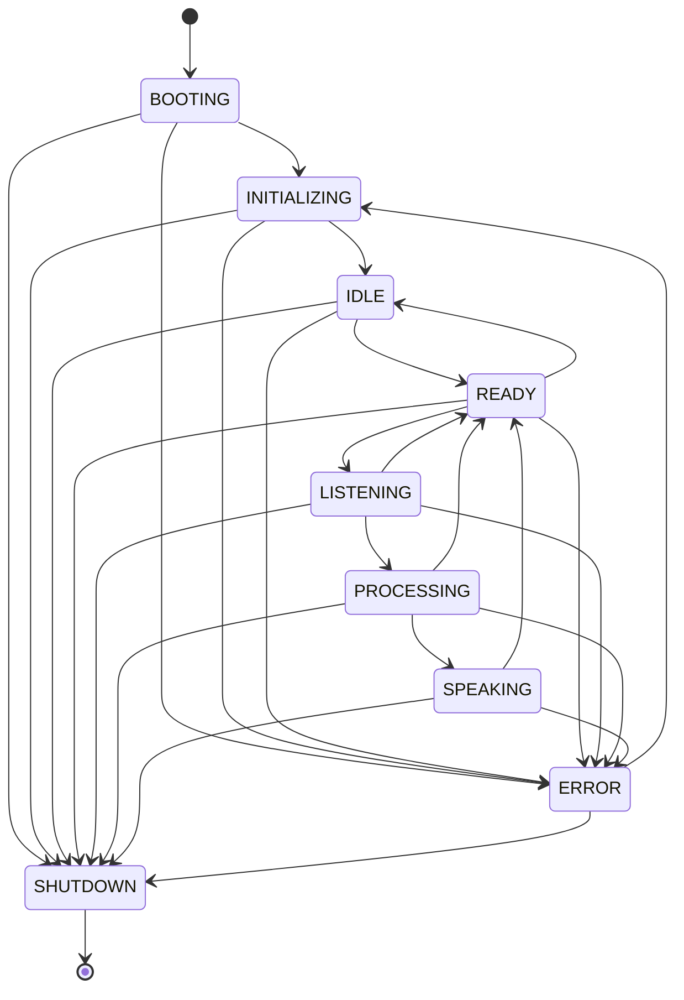

# Finite State Machine (FSM) Documentation

This document describes the design, transition topology, lifecycle expectations, and error recovery strategies for the finite state machine (`RobotStateMachine`) implemented in Phase 3 of the Campus Helpdesk Robot.

---

## 1. FSM Lifecycle States

The state machine manages the lifecycle of the robot via 9 mutually exclusive states:

| State | Purpose | Entry Condition | Exit Condition | Recovery Strategy |
|---|---|---|---|---|
| **`BOOTING`** | Engine bootstrap | Main runtime launch | Configuration loaded | Restart process |
| **`INITIALIZING`** | Dependency loading | Configuration is valid | Services report healthy | Transition to `ERROR` |
| **`IDLE`** | Standby mode | FSM started / person left | Camera detects person | None |
| **`READY`** | Conversation ready | Person present | Speech start / timeout | Return to `IDLE` after timeout |
| **`LISTENING`** | Capturing voice | VAD triggers speech start | VAD triggers speech stop | Return to `READY` |
| **`PROCESSING`** | Inference active | Speech stop detection | Inference completed | Transition to `ERROR` |
| **`SPEAKING`** | TTS audio playing | Answer is generated | Audio completes / interrupt | Stop playback, return to `READY` |
| **`ERROR`** | Degraded / Fault state | Fatal service crash | Reset sequence | soft reload (`INITIALIZING`) |
| **`SHUTDOWN`** | Graceful stop | Shutdown requested | Process terminates | Hard power cycle |

---

## 2. Transition Graph

The valid transitions are strictly limited to prevent state corruption:

*Note: Any state (except `SHUTDOWN`) can transition to `ERROR` or `SHUTDOWN` at any time.*

---

## 3. Thread Model

The FSM guarantees structural integrity and consistency through the following practices:
* **Reentrant Locking**: State reads and transition requests use a reentrant lock (`threading.RLock`), protecting against concurrency issues when multiple background services trigger transitions.
* **Hook Isolation**: Callbacks (`on_enter`, `on_exit`, `on_transition`) are executed inside `try-except` blocks. Exceptions inside hook callbacks are captured and logged, preventing them from corrupting the state transitions or rolling back the state change.
* **Precision Timings**: Windows timer constraints are bypassed by using `time.perf_counter()` to record microsecond-level accuracies in transition records and state durations.

---

## 4. Best Practices

1. **Do not execute heavy synchronous work in hooks**: Hooks run synchronously on the transitioning thread. Keep hook callbacks non-blocking.
2. **Never change state directly**: Always use the FSM's `transition_to(target_state)` to ensure exit/entry hooks run and metrics are recorded.
3. **Use the Diagnostics API**: Leverage `fsm.diagnostics()` to feed real-time monitoring dashboard widgets.
