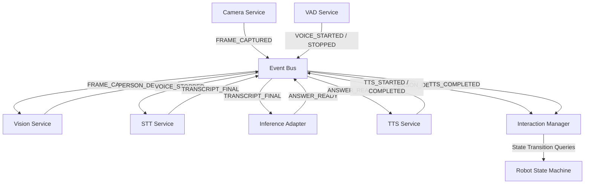

# End-to-End System Runtime Documentation

This document describes the design, startup/shutdown orchestration, conversation flows, resilience/failure recovery profiles, and structured logging of the unified helpdesk interaction system runtime.

---

## 1. System Topology

The `SystemRuntime` acts as the single coordinator that manages, wires, and monitors all integrated services:

---

## 2. Startup & Shutdown Sequences

### Startup Order (Sequential & Verified)
1. **Event Bus** (Wired to all services)
2. **Camera Service** (Warms up capture interface)
3. **Vision Service** (Listens to frames)
4. **VAD Service** (Warms up microphone/VAD loop)
5. **STT Service** (Preloads Whisper model)
6. **Inference Adapter** (Warms up RAG Chat index)
7. **TTS Service** (Preloads Piper voice model)
8. **Interaction Manager** (Warms up FSM and checks timeouts)
9. **System Ready** (Publishes `SYSTEM_READY` to transition FSM from `BOOTING` to `IDLE`)

### Shutdown Order (Reverse Order)
1. **Interaction Manager** (Terminates FSM timeout threads)
2. **TTS Service** (Stops active speakers/playback)
3. **Inference Adapter** (Drains pending queries)
4. **STT Service** (Stops transcription worker)
5. **VAD Service** (Closes microphone stream)
6. **Vision Service** (Stops detector loop)
7. **Camera Service** (Releases video captures)
8. **Event Bus** (Drains thread pool queues)

---

## 3. Resilience & Failure Recovery Profiles

The integrated runtime handles hardware faults and query errors without halting the robot:
* **Camera Disconnection**: Emits `CAMERA_DISCONNECTED` and initiates automatic re-connection attempts in the background.
* **Microphone streaming error**: Emits `MICROPHONE_ERROR` which transitions the FSM to a safe state without halting VAD.
* **Inference Timeout**: Triggers `InferenceTimeoutError` after a configurable timeout limit (default 10s), publishing a non-fatal `ERROR` event. The robot FSM transitions to `READY` to prompt the user again.
* **Interrupted/Preempted Speech**: If the user speaks or walks away while the robot is speaking, the TTS player cancels playback immediately, emits `TTS_INTERRUPTED` showing the exact duration spoken, and services the new state immediately.

---

## 4. Structured Conversation Logging

The `ConversationTracker` logs details for every session in a single JSON block:
* **Timestamps**: Transition intervals (approach, speak, answer, complete).
* **Latencies**: Vision inference delay, VAD speech duration, STT transcription latency, RAG model inference overhead, and TTS playback duration.
* **Errors**: Captures stack traces of any non-fatal errors or timeouts during the session.
* **Completion States**: `SUCCESS`, `INTERRUPTED`, or `FAILED`.
